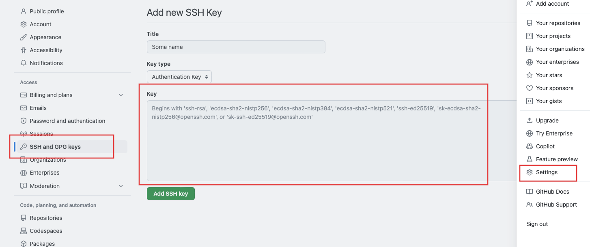
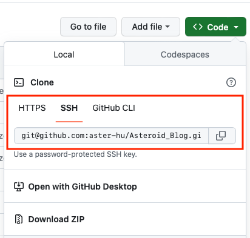

## Problem and goal {#problem-and-goal}

When configuring the git push/pull command, you might encounter the following error:

> fatal: could not read Username for 'https://github.com': Device not configured

This is because GitHub no longer supports username/password authentication. The simplest solution is to switch to SSH keys authentication instead of using a username and password.

After conducting some research, I've summarized the steps to resolve this error. In Step 4, I've also included detailed instructions on setting up automated git push using crontab.


## Step 1: Generate a new Github SSH key {#step-1-generate-a-new-github-ssh-key}

Below is the simple version. Refer to the [the official documentation](https://docs.github.com/en/authentication/connecting-to-github-with-ssh/generating-a-new-ssh-key-and-adding-it-to-the-ssh-agent) for a more detailed explanation.

1.  Open the Terminal app and paste the following code, replacing the email address.

    ```zsh
    ssh-keygen -t ed25519 -C "your_github_email@email.com"
    ```
2.  Press Enter when it asks for the file location to save the key.

    ```zsh
    > Enter a file in which to save the key (/Users/YOU/.ssh/id_ALGORITHM): [Press enter]
    ```
3.  When asked for a passphrase, enter a password and press Enter. Repeat the password again when it asks the second time.

    ```zsh
    > Enter passphrase (empty for no passphrase): [Type a passphrase]
    > Enter same passphrase again: [Type passphrase again]
    ```
4.  It should generate some text that look like below. The path in the second line is the name and the location of the key. Take note of this information.

    ```zsh
    Your identification has been saved in /Users/you/.ssh/id_ed12345
    Your public key has been saved in /Users/you/.ssh/id_ed12345.pub
    The key fingerprint is:
    SHA123:somerandomcharcters your_github_email@email.com
    The key's randomart image is:
    +--[ED12345 123]--+
    |E*==             |
    |..+ .            |
    |+xx=             |
    |.xxxo            |
    |xxx=..  S        |
    |o+=xxxxo         |
    |o.xxxxx          |
    |.+xxxxx          |
    | +=xxxx          |
    +----[SHA123]-----+
    ```


### Avoid entering passphrase everytime {#avoid-entering-passphrase-everytime}

In some cases, it may prompt to ask the passphrase everytime when running git:

```zsh
> Enter passphrase for /Users/you/.ssh/id_ed12345:
```

To avoid entering the passphrase every time, use the following commands in the Terminal:

```zsh
eval "$(ssh-agent -s)"
# Agent pid 11223
ssh-add
```

It would ask for the passphrase. Once type it and press Enter, it would not ask for passphrase every time.

```zsh
Enter passphrase for /Users/you/.ssh/id_ed12345:
Identity added: /Users/you/.ssh/id_ed12345 (your_github_email@email.com)
```


## Step 2: Add ssh to Github account {#step-2-add-ssh-to-github-account}

Following [this documentation](https://docs.github.com/en/authentication/connecting-to-github-with-ssh/adding-a-new-ssh-key-to-your-github-account) to add the ssh key to github:

In Terminal, paste below code in order to copy the SSH key to clipboard, replacing the \*.pub file location from #4 in Step 1.

```zsh
pbcopy < ~/.ssh/id_ed12345.pub
```

Navigate to your GitHub account and go to Github account **Setting - SSH and GPG keys - New SSH key**, and paste the key into the box.
  [](~/Library/CloudStorage/Dropbox/Code/Asteroid_Blog/post/2023-12-08-use-ssh-github-push-crontab/add_ssh.png)


## Step 3: Update remote origin to SSH {#step-3-update-remote-origin-to-ssh}

In Terminal, type below code to verify if SSH is effective.

```zsh
ssh -T git@github.com
# "Hi your_name! You've successfully authenticated, but GitHub does not provide shell access.
```

Last step before setting up cron job, we need to change the remote origin url in the local directory:

1.  In Terminal, use below sample code to navigate to the local git repository and verify the existing git remote url. If it shows the HTTPS url as below, continue the steps, otherwise, skip to Step 4.

    ```zsh
    cd my/folder/path
    git remote -v
    # origin  https://github.com/USERNAME/REPOSITORY.git (fetch)
    # origin  https://github.com/USERNAME/REPOSITORY.git (push)
    ```
2.  Go to the Github repository page, click the green **Code** button and select **SSH**, copy the remote url<br />
    [](ssh_remote_url.png)
3.  In Terminal, use below code to update the remote from HTTPS to SSH. Replace the path with the url from the previous step.

    ```zsh
    git remote set-url origin https://github.com/USERNAME/REPOSITORY.git
    ```
4.  To verify, enter below code to confirm it has been switched to SSH remote url.

    ```zsh
        #+begin_src zsh
    git remote -v
    # origin  git@github.com:USERNAME/REPOSITORY.git (fetch)
    # origin  git@github.com:USERNAME/REPOSITORY.git (push)
    ```

If you need more details, check [the official documentation](https://docs.github.com/en/get-started/getting-started-with-git/managing-remote-repositories).


## Step 4: Automate Github push via crontab on macOS {#step-4-automate-github-push-via-crontab-on-macos}


### Create a .sh file for git command {#create-a-dot-sh-file-for-git-command}

First, create a file named `myfile.sh` that contains the terminal command of git push as below. Note that the first line has to be `!/bin/zsh` to make it effective. These command would check out the local git repository and push all changes to Github with a commit message includes timestamp.

```sh
#!/bin/zsh

# Check out repo
cd "/Users/myname/path_to_project/"
git add -A
git commit -m "Automated commit on $(date '+%Y-%m-%d %H:%M:%S')"
git push
```


### Set up cron job via crontab in Terminal {#set-up-cron-job-via-crontab-in-terminal}

Then we can set up the cron job in Terminal by editing the crontab file:

```zsh
crontab -e
```

The Terminal will show a blank window to edit. If this is your first time to edit file in Terminal, the navigation is based on an old-school text editor called Vim, so the "normal" keyboard commands like Ctrl-C Ctrl-V won't work here.

To start typing, press `i` to enter edit mode (you will see the `- INSERT -` shows at the bottom), and enter the crontab command in below format. When it's in edit mode, you can use the arrow key and Ctrl-C Ctrl-V to edit the text as normal. If you're interested in more keyboard shortcut, see [Vim shortcut cheatsheet](https://vim.rtorr.com/) for more details.

```txt
0 0 * * 1 /Users/myname/path_to_sh/myfile.sh >> /Users/myname/path_to_sh/myfile.log 2>&1
```

`0 0 * * 1` is the automated schedule format and it means "At 00:00 on Monday", so this cron job will execute the \`.sh\` every Monday at midnight, and output the log to the file \`myfile.log\`, which allows us to check potential error messages. You can change the schedule as you like by using [crontab.guru](https://crontab.guru) website to test the schedule format. For example, `0 * * * *` means the script will be run every hour at minute 0.

Once you finish editing, press Esc to exit the edit mode (the `- INSERT -` would disappear), then type `:wq` with keyboard and press Enter. During typing, you should see `:wq` shows at the bottom of the window.

The Terminal will back to the previous window, and shows it's installing the new cron job.

```zsh
# crontab: installing new crontab
```

It's done! You can set up a command with a shorter schedule window for testing. If it fails, you can always check the \`myfile.log\` for error messages and debug it accordingly.

---

Credit:
The schedule icon in the thumbnail image is created by [Flaticon](https://www.flaticon.com/free-icon/calendar_661512?related_id=661512).
