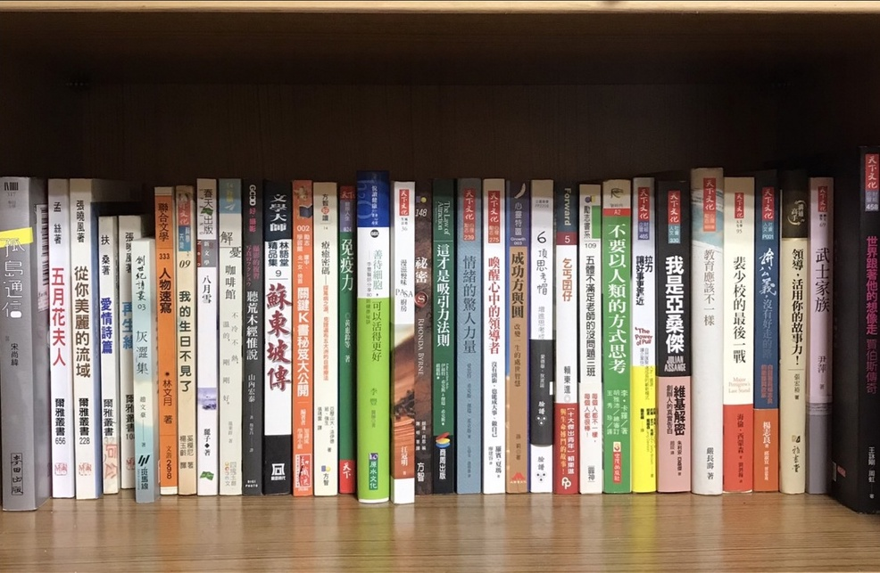
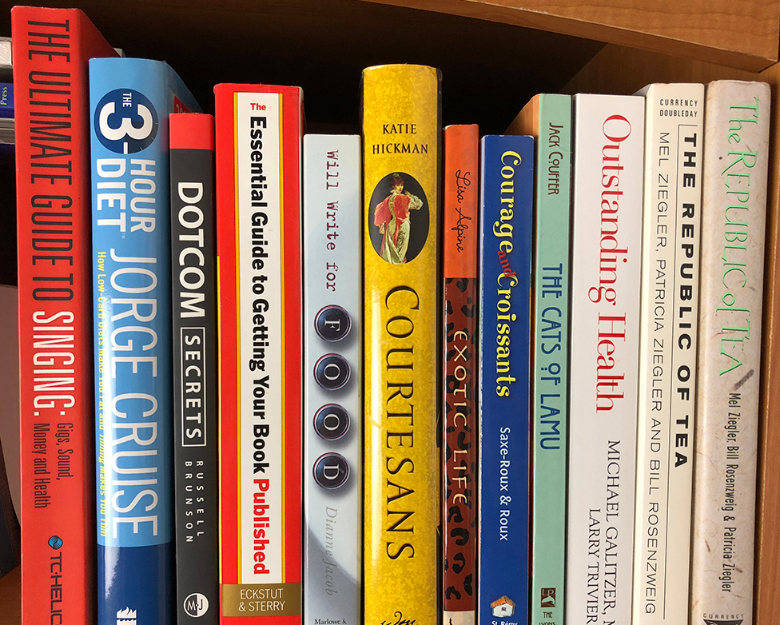
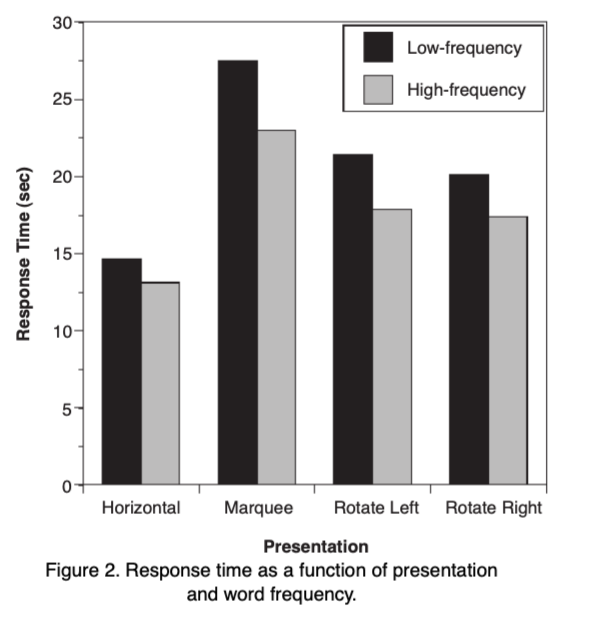
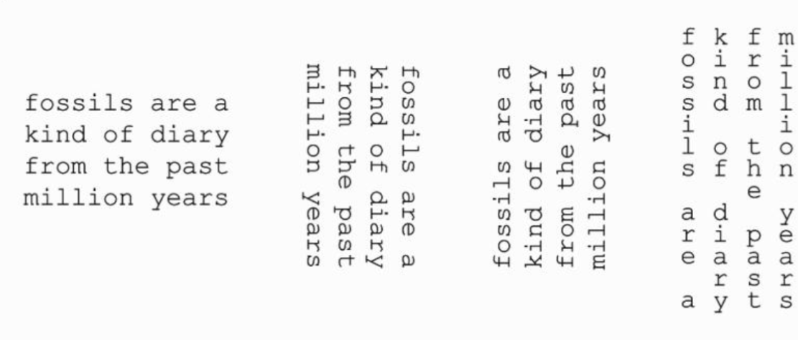
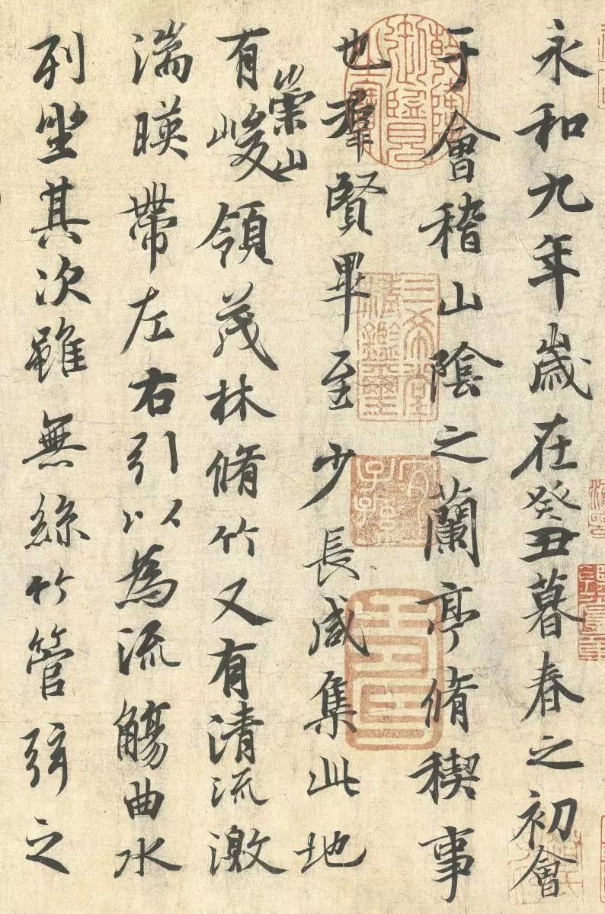
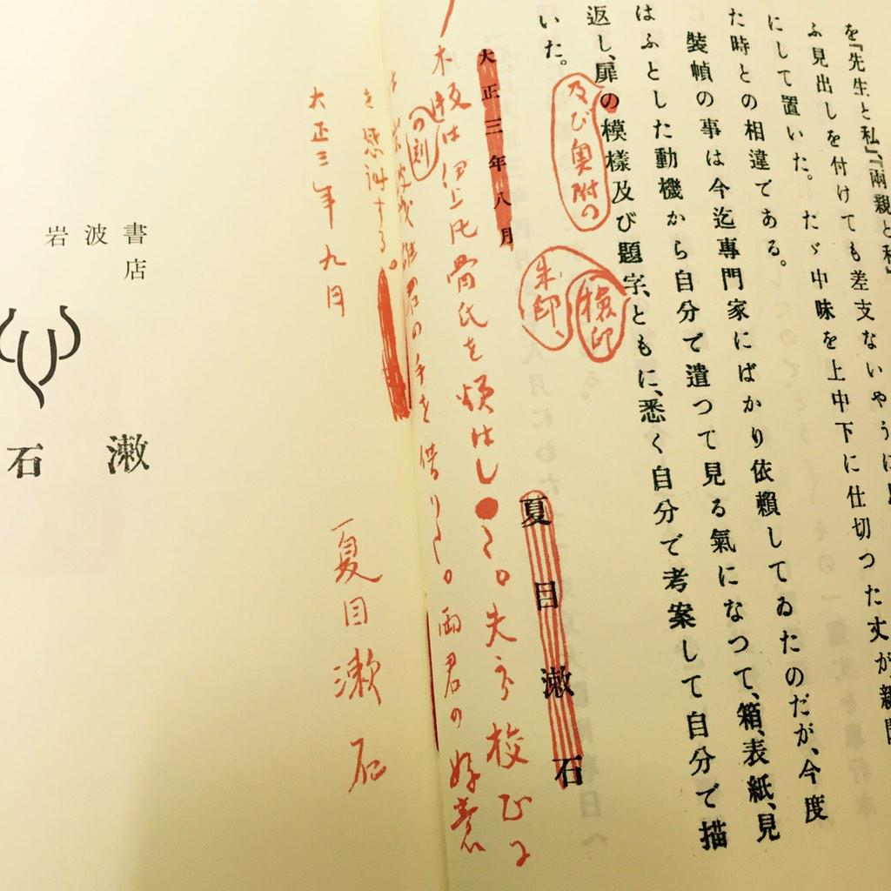

## Read text vertically in book spines {#read-text-vertically-in-book-spines}

Every time when I visit a bookstore, I wonder how people can read book spines without breaking their neck. Born and raised in China, I have gotten used to read book spines in marquee style text, which is a vertical style in a downward cascade of letters. However, in North America, the title on the book spine are arranged in rotated text, usually clockwise. It gives me a hard time to scan the books quickly and I always have to tilt my head to do so, which usually end up with a sore neck walking out of the book store.

 Books in Chinese on a shelf. Credit: biggo.com.tw

 Books in English on a shelf. Credit: [A Quick Look at the Fine Art of Book Spine Design - The Book Designer](https://www.thebookdesigner.com/quick-look-fine-art-book-spine-design/)

## Western research on reading vertical text {#western-research-on-reading-vertical-text}

It can't be just me who experiences this problem, but to my surprise, there aren't many discussions around this topic on the internet.

Some psychologists have done research about it. An experiment in 2002[^fn:1] found that marquee text is read more slowly than rotated text, and the direction of rotated text does not seem to affect reading speed, and lastly, as expected, rotated text is read more slowly than standard horizontal text. Another similar experiment[^fn:2] also came to the same observation.

 
Byrne, Michael. (2002). Reading Vertical Text: Rotated VS. Marquee

However, I have the opposite experience because I read much faster in marquee than rotated ones. It seems like neither the internet nor the research agree with my opinion.

## The opposite result: Chinese social media poll about reading vertical text {#the-opposite-result-chinese-social-media-poll-about-reading-vertical-text}

I think it must have something to do with culture differences. To prove it, I started a poll in a social media platform, in which most users are native Chinese speakers and can read English. In the poll, I asked which of the following vertical text is read fastest for them. This is a single choice question; they can only select the one they think they read the fastest.

 The sample text used in my poll

Here is the result I got with a sample of 80 participants:

1.  Clockwise 90°: **52.5%**
2.  Counterclockwise 90°: **16.3%**
3.  Marquee: **31.3%**

The result is completely different from the research experiment, which I believe was done among English speakers. In my poll, while there are over half of the voters believe that they read clockwise rotated text the fastest, there're also 31.3% of voters think marquee text is read the fastest among three options. Some comments also suggested I should have add a forth option - a vertical text in a downward but from right to left - like most books in Traditional Chinese.

From the poll result, the counterclockwise option received the lowest votes, but I couldn't simply draw the conclusion that it is the slowest, because there are many other factors that can explain this result. One possibility, for example, could be that the voters who chose clockwise text may rank counterclockwise text as their second fastest, but the poll only allowed them to choose one option. In such case, the fact that they can also read counterclockwise pretty fast would be lost during this process.

## A practical reason behind the design? {#a-practical-reason-behind-the-design}

There's a saying that the western style's clockwise and counterclockwise rotated text may have valid reasons behind it. I  was unable to validate the source, but it sounds somewhat plausible.

For clockwise or descending titles, this design ensures that the title is in a readable orientation when the cover faces up, so that people can quickly scan the title when books are placed in a stack like on a table. However, if there is only one book, it's less useful because you can read the title from the cover anyways.

On the other side, counterclockwise or ascending titles are more common in continental Europe and Latin America[^fn:3]. For this type of design, people can read the book title even when the front cover faces down.

## China's influence: vertical characters from ancient times {#china-s-influence-vertical-characters-from-ancient-times}

For China and Japan, the marquee style text exists for a long time due to historical reasons in ancient China. Vertical stroke is one of the two most important components of Hanji character (the another one is horizontal stroke). In ancient times, Chinese people wrote characters from top to bottom, right to left, because vertical writing creates a vertical axis and has better control of the downward movement. In short, writing character vertically produces straighter and smoother writing. Under the influence of ancient China, Japan also adopted the same practice.

The below Chinese calligraphy is one of the famous calligraphy work, and it's written top down, right to left.

 **Wang Xizhi,** _Preface to the Orchid Pavilion Manuscript, dated 353 AD_ Collection National Palace Museum-Beijing.

### Modern practice of marquee style in Japan and Taiwan {#modern-practice-of-marquee-style-in-japan-and-taiwan}

Book prints in the ancient vertical style no longer exist in modern China since mid-20th century. Japan and Taiwan, however, still keep the old fashion for some books. If you read Japanese novels or mangas, this is probably not news to you. In these types of books, the text is still read from top to bottom, and the order of the columns goes from right to left. This style only applies to fiction though, for non-fiction books, they have adopted the horizontal style from the west.

 An inner page from 夏目漱石「こゝろ」(Kokoro - Natsume Sōseki). Credit: [Twitter [cite/t:@KinoShinjuku](https://twitter.com/KinoShinjuku/status/537828929357094913?s=20)]

## Final words {#final-words}

To wrap up, I think I have some evidence to show that the previous research was biased toward western culture, and that culture/language differences should be considered as an impact factor.

Which style do you read the fastest and slowest? Do you think the marquee text would help the sore neck when books are shelved?

## Related articles {#related-articles}

-   [Differences Between Traditionally Printed and PRC Standard Chinese Books -- 廣府話小研究Cantonese Resources](https://writecantonese8.wordpress.com/2011/06/17/traditional-chinese-and-prc-chinese-printings/)
-   [Huijian Wu's answer to Since the Japanese language is read left to right just like most languages, why is 'manga' read right to left (the images and the bubbles) with the text left to right? - Quora](https://qr.ae/prWg0f)

[^fn:1]: Byrne, Michael. (2002). Reading Vertical Text: Rotated VS. marquee. Proceedings of the Human Factors and Ergonomics Society Annual Meeting. 46. 10.1177/154193120204601722.
[^fn:2]: Yu, D., Park, H., Gerold, D., &amp; Legge, G. E. (2010). Comparing reading speed for horizontal and vertical English text. _Journal of vision_, /10/(2), 1--17. <https://doi.org/10.1167/10.2.21>
[^fn:3]: Bookbinding Wikipedia [Bookbinding - Wikipedia](https://en.wikipedia.org/wiki/Bookbinding#Orientation)
