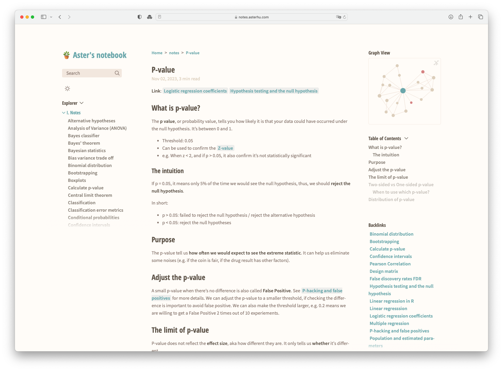

## Demo {#demo}

The Notes section in this blog direct to [my personal wiki site](https://notes.asterhu.com), which is built with [Quartz](http://quartz.jzhao.xyz) from org-mode. Quartz is a static-site generator that transforms markdown files to a wiki-like site; some people also refer to it as digital garden. I have all my `.org` notes with backlinks in **org-mode**, and use **[ox-hugo](http://ox-hugo.scripter.co)** to export to hugo-flavoured markdown files, so that **Quartz** can render a functional website using its plugin.
[](my_garden.png)


## Motivation {#motivation}

-   I write all my notes in org-mode. However, it can be hard to read sometimes, especially when there are lots of Latex formulas.
-   By publishing my notes, I can read them even when I'm away from my computer.
-   Although there are plenty of publishing solutions for org-mode, Quartz is one of the best site generators with features that are great for digital garden, such as the graph view and hover page. Thanks to its [OxHugoFlavouredMarkdown](https://quartz.jzhao.xyz/features/OxHugo-compatibility) plugin, Quartz is compatible with the ox-hugo export format, so the setup is pretty much out-of-box.


## Prerequisite {#prerequisite}

-   A working Emacs configuration
-   [Org-roam](https://ox-hugo.scripter.co/) basic setup

Org-mode itself is awesome for managing todo and notes. At some point, I discovered org-roam, a package that's inspired by Roam Research. Combining the powerful org-mode and org-roam, it becomes my knowledge management tool to quickly jot down notes and gradually build a knowledge base of my own.

I won't spend too much time on this topic because emacs is a rabbit hole. Check [System Crafters' Build a Second Brain in Emacs with Org Roam](https://systemcrafters.net/build-a-second-brain-in-emacs/getting-started-with-org-roam/) tutorial for more information about org-roam setup.


## Install and set up Quartz {#install-and-set-up-quartz}


### Initialize site with Quartz {#initialize-site-with-quartz}

Quartz is extremely easy to set up, even if you aren't familiar with hugo or any other static site generator. Following the [getting started guide](https://quartz.jzhao.xyz/#-get-started), the initialization only takes few minutes and it's already a nice-looking out-of-box digital garden site.

During the initialization, it asked for content info and I chose `Empty quartz` for a fresh site. It also asked how it should handle links and I chose the shortest path.

```zsh
◇  Choose how to initialize the content in `/path/of/quartz/content`
│  Empty Quartz

◇  Choose how Quartz should resolve links in your content. You can change this later in
`quartz.config.ts`.
│  Treat links as shortest path
```

After the initialization, I ran `npx quartz build --serve` to preview. The site is ready, and I just need to put notes in markdown format in `content/` folder.


### Directory structure and config files {#directory-structure-and-config-files}

```text
├── content
│   ├── braindump
│   ├── notes
│   └── index.md
├── ...
├── quartz.config.ts
└── quartz.layout.ts
```

Similar to [hugo](https://gohugo.io), Quartz also uses `content/` folder to store content files of the site, where the `index.md` is the landing page of Quartz.

Quartz supports nested folders and will display them in [Explorer](https://quartz.jzhao.xyz/features/explorer) and [Folder Listings](https://quartz.jzhao.xyz/features/folder-and-tag-listings), and I put `braindump` and `notes` as subfolders to separate my personal and study notes under `content/`.

`quartz.config.ts` and `quartz.layout.ts` are the two configuration files, in which `quartz.config.ts` defines the website's basic settings such as plugins, site url, website title, etc., while `quartz.layout.ts` controls the site's layout and style. The variables are quite self-explainatory, and Quartz's [configuration guide](https://quartz.jzhao.xyz/configuration) is everything you need to complete the setup.

To enable its compatibility with the hugo-flavoured markdown exported from org-mode, simply add `Plugin.OxHugoFlavouredMarkdown` to the `quartz.config.ts` file:

```ts
 plugins: {
  transformers: [
    // ...
    Plugin.OxHugoFlavouredMarkdown(),
    Plugin.GitHubFlavoredMarkdown(),
    // ...
  ],
},
```


### Hosting and deployment {#hosting-and-deployment}

Quartz provides guide on [setting up Github repository](https://quartz.jzhao.xyz/setting-up-your-GitHub-repository) and [hosting](https://quartz.jzhao.xyz/hosting) from different hosting providers. I use Cloudflare Pages, but any other provides that can deploy static HTML should work.


## Org-roam and ox-hugo setup {#org-roam-and-ox-hugo-setup}

To publish org-roam notes, I use ox-hugo's [one post per org file workflow](https://ox-hugo.scripter.co/doc/blogging-flow/) to export markdown for each org file. Ox-hugo prefers one post per org subtree, but it's not the way org-roam works. Anyways, this one post per org file workflow works for me and I didn't find any functionality it's lacking.


### Front matter in org-roam notes {#front-matter-in-org-roam-notes}

Quartz and hugo shares [the same front matter](https://quartz.jzhao.xyz/authoring-content), and because ox-hugo support hugo's front matter, it also supports Quartz's without any modification. When I take notes in org-mode, I use templates to add the metadata based on [ox-hugo's documentation](https://ox-hugo.scripter.co/doc/org-meta-data-to-hugo-front-matter/), and ox-hugo will convert those metadata to the front matter when exporting org to markdown files.

For the front matter in the note level,I try to keep it simple (additional configurations will be covered in folder level, [see below](#ox-hugo-export-config)):


Org-roam notes' front matter

-   `#+filetags`: the tags of the note in the Quartz site
-   `#+hugo_section`: the sub folder of Quartz's `content/` directory
-   `#+date`: self-explanatory
-   `#+hugo_lastmod`: define the last modified date, which is the preferred date I set in my `quartz.config.ts`


### Ox-hugo export config {#ox-hugo-export-config}

Based on [ox-hugo's guide about auto-saving](https://ox-hugo.scripter.co/doc/auto-export-on-saving/), I created a `.dir-locals.el` file in my `org-roam-directory`. These settings will be applied to all files under the selected folder.

```lisp
(("1-main/"
  . ((org-mode . (
                  (eval . (org-hugo-auto-export-mode))
                  (org-hugo-base-dir . "/path/to/digital-garden")
                  (org-hugo-front-matter-format . "yaml")
                  ))
     )))
```

`1-main/` is the folder where the settings will be applied:

-   `org-hugo-auto-export-mode`: ox-hugo's auto-saving function
-   `org-hugo-base-dir`: in this case, it's the Quartz directory
-   `org-hugo-front-matter-format`: set the front matter to yaml


### Exclude notes from export {#exclude-notes-from-export}

To exclude notes that are not to be exported by `org-hugo-auto-export-mode`, we can define it by adding a special tag `#+hugo_tags: noexport` to these notes. In my `org-roam-capture-templates`, I have `#+hugo_tags: noexport` in front matter for all of my notes. If I want to publish the note, I will remove this tag or comment the line, and ox-hugo will pick it up and export it to markdown.

```lisp
(setq org-roam-capture-templates
      '(("o" "moc" plain
         "\n*Link*:  %?\n\n"
         :if-new (file+head "1-main/${slug}.org" "#+title: ${title}\n#+filetags: :moc:\n#+hugo_section: braindump\n#+date: %u\n#+hugo_lastmod: %u\n#+hugo_tags: noexport\n")
         :immediate-finish t
         :unnarrowed t
         :empty-lines-after 1)))
```

If there's a specific subtree I do not want to export, I can also exclude it by tagging with `:noexport:`.


### Auto-update timestamp for org-roam notes on save {#auto-update-timestamp-for-org-roam-notes-on-save}

I also include a function in my Emacs config so that it automatically updates `#+hugo_lastmod` whenever I press save. Of course, I can also use ox-hugo's `#+hugo_auto_set_lastmod: t`, but I prefer to have the date shown within my org files.

```lisp
;; Update last modified date for ox-hugo export
(after! org
  (setq time-stamp-active t
        time-stamp-start "#\\+hugo_lastmod:[ \t]*"
        time-stamp-end "$"
        time-stamp-format "\[%Y-%m-%d\]")
  (add-hook 'before-save-hook 'time-stamp))
```


## My note-taking and publishing workflow {#my-note-taking-and-publishing-workflow}

My publishing workflow is extremely simple:

-   When I create a new org-roam note, it pops up with front matter templates.
-   Once I finish writing, if I want to publish the note, I remove the `#+hugo_tags: noexport` tag.
-   When I hit save, Emacs automatically updates the `#+hugo_lastmod` to the current date. Meanwhile, it will convert `.org` to `.md` and show a message in the echo area, indicating the location of `.md` file.
-   Once in a while, I go to the Quartz directory and use `magit` to push changes to Github. I could [automate this step by setting a cron job](/post/2023-12-21-use-ssh-github-push-crontab/), but I prefer to have a bit more control in case I accidentally upload my private notes.


## Limitations {#limitations}


### Callout formatting {#callout-formatting}

Because I'm writing in org, I won't be able to use some nice features that are packaged with Quartz such as the Obsidian-style [callout](https://quartz.jzhao.xyz/features/callouts). A workaround is to insert `#+begin_export md` snippet to show the callout box in the published site:

```lisp
#+begin_export md
> [!note] An intuitive way to think about why it makes more sense.
> The distribution that are closer to normal distribution usually makes more sense. In this example, the distribution of group C and of D in alternative hypothesis are more closer to normal distribution (compare the data points vs the mean)
#+end_export
```

Output:


### Image handling between org-mode and Quartz {#image-handling-between-org-mode-and-quartz}

For image linking, it becomes a bit tricky. [Ox-hugo will copy images](https://ox-hugo.scripter.co/doc/image-links/) to `static/` folder, which Quartz doesn't use and will be emitted. I didn't find the option to change the image output directory in ox-hugo, so I ended up manually copying all my images from `static/ox-hugo` to `content/ox-hugo` when I push the changes.


### Speed of global graph {#speed-of-global-graph}

In Quartz, the local graph looks decent, but the global graph gets significantly slower with the increasing number of notes. I do not use the global graph in Quartz (I prefer `org roam ui mode` that comes with org-roam) so it's not an issue for me. And if I have to, I can always refer to [Hugo Cisneros' blog](https://hugocisneros.com/blog/my-org-roam-notes-workflow/#publishing) to build one from scratch from the org-roam db.
